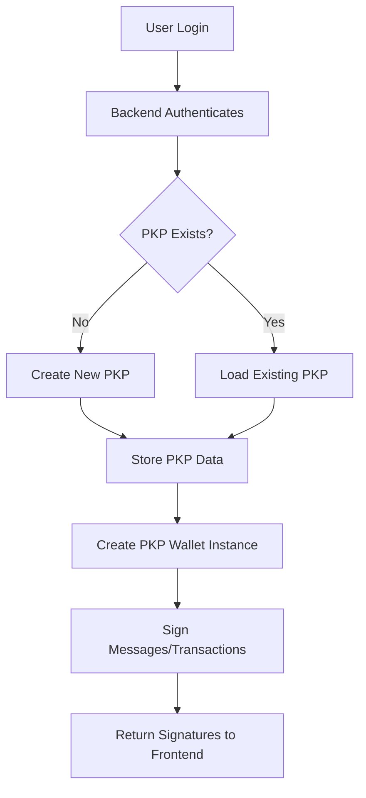

# 🔐 PKP Wallet-as-a-Service SDK

 Programmable Key Pair (PKP) wallet management system built on Lit Protocol. Create deterministic, multi-chain wallets for your users without them needing to manage private keys.

## 🌟 What is this?

This SDK allows you to create **deterministic blockchain wallets** for your users using Lit Protocol's PKP technology. Users get the same wallet address every time they log in, can sign messages and transactions across multiple blockchains, and never need to see or manage private keys.

**Perfect for:**

- 🚀 Web3 apps with Web2-like UX
- 🎮 Gaming applications
- 💰 DeFi platforms with gasless transactions
- 🏢 Enterprise blockchain applications
- 📱 Mobile apps requiring seamless crypto integration

## ⚡ Key Features

- ✅ **Deterministic Wallets**: Same wallet address per user across sessions
- ✅ **Multi-Chain Support**: Ethereum, Polygon, Arbitrum, Optimism, and more
- ✅ **Multiple Signing Methods**: Messages, transactions, EIP-712, ERC-2612 permits
- ✅ **Gasless Transactions**: Support for meta-transactions and permits
- ✅ **Production Ready**: Persistent storage, error handling, TypeScript support
- ✅ **Developer Friendly**: Clean API, batch operations, built-in verification

## 🏗️ How It Works



### Current Architecture (Single Master Key)

1. **Master Key (Backend)**: Your server holds a master private key that creates PKPs
2. **Deterministic Creation**: Each user gets a unique, consistent PKP wallet
3. **Session Management**: Lit Protocol handles distributed key management
4. **Multi-Chain**: Same PKP works across different blockchain networks

### 🔐 Decentralization Migration Path

The current system uses a **single master private key** for PKP creation. While this provides fast onboarding, you can progressively decentralize control:

#### **Phase 1: Multisig (Recommended First Step)**

Replace the single master key with a multisig wallet:

```typescript
// Current: Single master key
const masterWallet = new ethers.Wallet(PRIVATE_KEY, provider);

// Upgraded: Multisig wallet (2-of-3, 3-of-5, etc.)
import { GnosisSafeMultisig } from "./multisig";

class MultisigPKPManager extends PKPWalletManager {
  private multisig: GnosisSafeMultisig;

  constructor(multisigAddress: string) {
    this.multisig = new GnosisSafeMultisig(multisigAddress);
  }

  async createWallet(userData: UserData): Promise<PKPData> {
    // 1. Prepare PKP creation transaction
    const authMethod = await this.prepareAuthMethod();
    const txData = this.contractClient.interface.encodeFunctionData(
      "mintWithAuth",
      [authMethod, [AUTH_METHOD_SCOPE.SignAnything]]
    );

    // 2. Submit to multisig (requires multiple signatures)
    const proposal = await this.multisig.proposeTransaction({
      to: LIT_PKP_CONTRACT_ADDRESS,
      data: txData,
      value: 0,
    });

    console.log(`📝 PKP creation proposal: ${proposal.id}`);
    console.log(`⏳ Waiting for ${this.multisig.threshold} signatures...`);

    // 3. Wait for threshold signatures
    await this.multisig.waitForExecution(proposal.id);

    // 4. PKP is created once multisig executes
    return this.extractPKPFromTransaction(proposal.executionTx);
  }
}
```

**Benefits:**

- ✅ **Distributed Control**: Requires 2-of-3 or 3-of-5 signatures
- ✅ **No Single Point of Failure**: No one person can create PKPs alone
- ✅ **Battle-Tested**: Gnosis Safe has billions in assets secured

#### **Phase 2: DAO Governance**

Add community voting for PKP creation:

```typescript
// DAO-controlled PKP creation
contract PKPGovernance {
    struct PKPProposal {
        address requester;
        string userData;  // JSON string of user data
        uint256 votesFor;
        uint256 votesAgainst;
        bool executed;
        uint256 deadline;
    }

    mapping(uint256 => PKPProposal) public proposals;
    mapping(address => uint256) public votingPower;  // Token-based voting

    uint256 public constant VOTING_PERIOD = 3 days;
    uint256 public constant QUORUM = 100000e18;  // 100k tokens

    function proposePKPCreation(
        address requester,
        string calldata userData
    ) external returns (uint256 proposalId) {
        require(votingPower[msg.sender] >= 1000e18, "Insufficient voting power");

        proposalId = ++proposalCount;
        proposals[proposalId] = PKPProposal({
            requester: requester,
            userData: userData,
            votesFor: 0,
            votesAgainst: 0,
            executed: false,
            deadline: block.timestamp + VOTING_PERIOD
        });

        emit PKPProposal(proposalId, requester, userData);
    }

    function vote(uint256 proposalId, bool support) external {
        PKPProposal storage proposal = proposals[proposalId];
        require(block.timestamp <= proposal.deadline, "Voting ended");

        uint256 power = votingPower[msg.sender];

        if (support) {
            proposal.votesFor += power;
        } else {
            proposal.votesAgainst += power;
        }
    }

    function executePKPCreation(uint256 proposalId) external {
        PKPProposal storage proposal = proposals[proposalId];
        require(block.timestamp > proposal.deadline, "Voting still active");
        require(!proposal.executed, "Already executed");
        require(proposal.votesFor > proposal.votesAgainst, "Proposal failed");
        require(proposal.votesFor >= QUORUM, "Quorum not met");

        proposal.executed = true;

        // Create PKP via Lit Protocol
        IPKPContract(LIT_PKP_CONTRACT).mintWithAuth(
            authMethod,
            [AUTH_METHOD_SCOPE.SignAnything]
        );
    }
}
```

**Implementation:**

```typescript
class DAOPKPManager extends PKPWalletManager {
  private governanceContract: ethers.Contract;

  async requestPKPCreation(userData: UserData): Promise<string> {
    // Submit proposal to DAO
    const tx = await this.governanceContract.proposePKPCreation(
      userData.id,
      JSON.stringify(userData)
    );

    const receipt = await tx.wait();
    const proposalId = receipt.events[0].args.proposalId;

    console.log(`📋 PKP proposal submitted: ${proposalId}`);
    console.log(`🗳️  Community voting period: 3 days`);
    console.log(`📊 Required quorum: 100,000 tokens`);

    return proposalId;
  }

  async checkProposalStatus(proposalId: string): Promise<{
    status: "voting" | "passed" | "failed" | "executed";
    votesFor: string;
    votesAgainst: string;
  }> {
    const proposal = await this.governanceContract.proposals(proposalId);
    // Return current voting status
  }

  async executeApprovedProposal(proposalId: string): Promise<PKPData> {
    await this.governanceContract.executePKPCreation(proposalId);
    // Extract PKP data from transaction logs
  }
}
```

#### **Phase 3: Fully Distributed (Advanced)**

Use Distributed Key Generation (DKG) or recursive PKPs:

```typescript
// Recursive PKPs: PKPs creating other PKPs
class RecursivePKPManager {
  private masterPKP: PKPData; // Controlled by Lit's distributed network

  async createUserPKP(userData: UserData): Promise<PKPData> {
    // Master PKP creates user PKPs based on Lit conditions
    const masterWallet = new PKPEthersWallet({
      pkpPubKey: this.masterPKP.publicKey,
      litNodeClient: this.litClient,
      authContext: {
        // Lit conditions define when master PKP can create new PKPs
        litActionConditions: [
          {
            // Only allow PKP creation if conditions are met
            // (e.g., DAO approval, specific time windows, etc.)
            resourceId: "pkp-creation-action",
            conditions: [
              { method: "eth_call", params: ["checkDAOApproval", userData.id] },
            ],
          },
        ],
      },
    });

    // Master PKP signs the creation transaction
    return await this.contractClient.mintWithAuth({
      authMethod: createAuthMethodFromPKP(masterWallet),
      scopes: [AUTH_METHOD_SCOPE.SignAnything],
    });
  }
}
```

### 📊 Decentralization Comparison

| Approach           | Decentralization | Speed      | Complexity | Security   | Cost      |
| ------------------ | ---------------- | ---------- | ---------- | ---------- | --------- |
| **Single Key**     | ❌ Low           | ✅ Instant | ✅ Simple  | ⚠️ Medium  | ✅ Low    |
| **Multisig**       | ⚠️ Medium        | ⚠️ Minutes | ✅ Simple  | ✅ High    | ✅ Low    |
| **DAO Governance** | ✅ High          | ❌ Days    | ⚠️ Medium  | ✅ High    | ⚠️ Medium |
| **Distributed**    | ✅ Highest       | ❌ Complex | ❌ Complex | ✅ Highest | ❌ High   |

### 🛣️ Recommended Migration Path

```typescript
// Phase 1: Start simple (current system)
const pkpManager = new PKPWalletManager(PRIVATE_KEY);

// Phase 2: Add multisig (when you have a team)
const multisigManager = new MultisigPKPManager("0x123..."); // 2-of-3

// Phase 3: Add governance (when you have a community)
const daoManager = new DAOPKPManager(governanceContract);

// Phase 4: Full decentralization (when you're ready)
const distributedManager = new RecursivePKPManager(masterPKP);
```

**Timeline:**

- **Month 1-3**: Single key (rapid prototyping)
- **Month 3-6**: Multisig (team formation)
- **Month 6-12**: DAO governance (community building)
- **Year 2+**: Full decentralization (mature protocol)

## 🚀 Quick Start

### Prerequisites

- Node.js 16+
- A private key with some testnet funds (for PKP creation)
- Basic understanding of blockchain wallets

### Installation

```bash
# Clone the repository
git clone <your-repo>
cd lit-protocol

# Install dependencies
npm install

# Copy environment configuration
cp config.example.ts config.ts
```

### Environment Setup

Create a `.env` file:

```env
PRIVATE_KEY=your_master_private_key_here
```

**⚠️ Security Note**: In production, store this private key securely (AWS KMS, HashiCorp Vault, etc.)

## 🧪 Testing the System

### Method 1: Run the Complete Demo

```bash
# Run the full demonstration
npm run demo

# Or directly:
npx ts-node src/index.ts
```

This will:

1. Create PKP wallets for 3 test users (Alice, Bob, Charlie)
2. Test message signing
3. Test transaction signing
4. Test EIP-712 typed data signing
5. Show wallet balances and info
6. Demonstrate deterministic wallet behavior

### Method 2: Run Simple Examples

```bash
# Run focused examples (recommended for learning)
npm run examples

# Or directly:
npx ts-node src/examples.ts
```

This will run:

1. Basic wallet creation and message signing
2. Multi-chain operations demo
3. EIP-712 structured data signing
4. ERC-2612 permit signing (gasless approvals)

### Method 3: Test Individual Components

```bash
# Test SDK usage patterns
npx ts-node src/demo-sdk.ts
```

### Method 4: Interactive Testing

```typescript
import { PKPWalletManager } from "./src/index";

async function test() {
  // Initialize
  const pkpManager = new PKPWalletManager(process.env.PRIVATE_KEY!);
  await pkpManager.initialize();

  // Create wallet
  const userData = {
    id: "test_user",
    name: "Test User",
    email: "test@example.com",
  };
  const pkp = await pkpManager.createWallet(userData);
  console.log("Created wallet:", pkp.ethAddress);

  // Sign message
  const signature = await pkpManager.signMessage("test_user", "Hello World!");
  console.log("Signature:", signature);

  // Verify signature
  const isValid = pkpManager.verifySignature(
    "Hello World!",
    signature,
    pkp.ethAddress
  );
  console.log("Valid:", isValid);
}

test().catch(console.error);
```

## 📚 SDK API Reference

### Initialization

```typescript
import { PKPWalletManager } from "./src/index";

const pkpManager = new PKPWalletManager(
  privateKey, // Master private key
  "DatilTest", // Lit network (optional)
  "./user-pkps.json" // Storage file (optional)
);

await pkpManager.initialize();
```

### Core Methods

#### `createWallet(userData: UserData): Promise<PKPData>`

Creates a deterministic PKP wallet for a user.

```typescript
const pkp = await pkpManager.createWallet({
  id: "user123",
  name: "Alice Smith",
  email: "alice@example.com",
});
// Returns: { tokenId, publicKey, ethAddress }
```

#### `signMessage(userId: string, message: string, options?): Promise<string>`

Signs a message with the user's PKP wallet.

```typescript
// Basic message signing
const signature = await pkpManager.signMessage("user123", "Hello World!");

// Multi-chain message signing
const ethSig = await pkpManager.signMessage("user123", "Hello!", {
  chain: "ethereum",
});
const polySig = await pkpManager.signMessage("user123", "Hello!", {
  chain: "polygon",
});
```

#### `signTypedData(userId, domain, types, value, chain?): Promise<string>`

Signs EIP-712 structured data.

```typescript
const domain = {
  name: "MyDApp",
  version: "1",
  chainId: 1,
  verifyingContract: "0x...",
};

const types = {
  Mail: [
    { name: "from", type: "address" },
    { name: "to", type: "address" },
    { name: "contents", type: "string" },
  ],
};

const value = {
  from: "0x...",
  to: "0x...",
  contents: "Hello!",
};

const signature = await pkpManager.signTypedData(
  "user123",
  domain,
  types,
  value,
  "ethereum"
);
```

#### `signERC2612Permit(userId, tokenAddress, permitData, chain?): Promise<string>`

Signs ERC-2612 permits for gasless token approvals.

```typescript
const permitData = {
  owner: "0x...",
  spender: "0x...",
  value: ethers.utils.parseEther("100").toString(),
  nonce: 0,
  deadline: Math.floor(Date.now() / 1000) + 3600,
};

const permit = await pkpManager.signERC2612Permit(
  "user123",
  "0xUSDC_TOKEN_ADDRESS",
  permitData,
  "ethereum"
);
```

#### `signTransaction(userId, transaction, chain?): Promise<string>`

Signs blockchain transactions.

```typescript
const signedTx = await pkpManager.signTransaction(
  "user123",
  {
    to: "0x742d35Cc6634C0532925a3b8D53d4ed75a3F2f4",
    value: ethers.utils.parseEther("0.1").toString(),
    gasLimit: 21000,
  },
  "ethereum"
);
```

### Utility Methods

#### `getWalletInfo(userId: string, chain?): Promise<WalletInfo>`

Get wallet address, balance, and nonce.

```typescript
const info = await pkpManager.getWalletInfo("user123", "ethereum");
console.log(info);
// { address: '0x...', balance: '0.5', nonce: 3, chainId: 1 }
```

#### `getSupportedChains(): string[]`

List all supported blockchain networks.

```typescript
const chains = pkpManager.getSupportedChains();
console.log(chains);
// ['ethereum', 'polygon', 'arbitrum', 'optimism', 'sepolia', 'datil']
```

#### `listUserWallets(): Promise<UserPKPData[]>`

Get all created user wallets from storage.

```typescript
const wallets = await pkpManager.listUserWallets();
wallets.forEach((w) => console.log(`${w.user.name}: ${w.pkp.ethAddress}`));
```

### Batch Operations

```typescript
// Sign messages for multiple users
const signatures = await pkpManager.batchSignMessages(
  ["user1", "user2", "user3"],
  "Batch message",
  "polygon"
);

// Get info for multiple wallets
const infos = await pkpManager.batchGetWalletInfo(
  ["user1", "user2", "user3"],
  "ethereum"
);
```

## 🌐 Supported Chains

| Chain    | Network     | Chain ID | RPC      |
| -------- | ----------- | -------- | -------- |
| Ethereum | Mainnet     | 1        | Llamarpc |
| Polygon  | Mainnet     | 137      | Llamarpc |
| Arbitrum | One         | 42161    | Official |
| Optimism | Mainnet     | 10       | Official |
| Sepolia  | Testnet     | 11155111 | Infura   |
| Datil    | Lit Testnet | 175188   | Lit RPC  |

## 💡 Real-World Examples

### Gasless DeFi Swap

```typescript
async function gaslessSwap(userId: string, amount: string) {
  // Step 1: Sign permit (gasless)
  const permit = await pkpManager.signERC2612Permit(
    userId,
    TOKEN_ADDRESS,
    {
      owner: userAddress,
      spender: DEX_CONTRACT,
      value: amount,
      nonce: await getTokenNonce(userId),
      deadline: Math.floor(Date.now() / 1000) + 3600,
    },
    "ethereum"
  );

  // Step 2: Submit to relayer (your backend pays gas)
  return await submitToRelayer({ permit, amount });
}
```

### Multi-Chain Gaming Assets

```typescript
async function transferGameAsset(
  userId: string,
  nftId: string,
  fromChain: string,
  toChain: string
) {
  // Sign on source chain
  const burnSig = await pkpManager.signTransaction(
    userId,
    {
      to: GAME_CONTRACT,
      data: encodeBurnNFT(nftId),
    },
    fromChain
  );

  // Sign mint authorization on destination chain
  const mintAuth = await pkpManager.signTypedData(
    userId,
    domain,
    types,
    {
      player: userAddress,
      nftId,
      sourceChain: fromChain,
    },
    toChain
  );

  return { burnSig, mintAuth };
}
```

### Social Login Integration

```typescript
// After user authenticates with Google/Discord/etc
async function onUserLogin(socialProfile: any) {
  const userData = {
    id: socialProfile.id,
    name: socialProfile.displayName,
    email: socialProfile.email,
  };

  // Always returns same wallet for same social ID
  const pkp = await pkpManager.createWallet(userData);

  // User now has a persistent blockchain wallet!
  return pkp.ethAddress;
}
```

## 🔒 Security Considerations

### Development vs Production

| Aspect     | Development       | Production      |
| ---------- | ----------------- | --------------- |
| Master Key | Local `.env` file | AWS KMS / Vault |
| Storage    | JSON file         | Database        |
| Auth       | Simulated         | Real OAuth/JWT  |
| Network    | Testnet           | Mainnet         |

### Best Practices

1. **Never expose master private key** to frontend
2. **Use environment variables** for sensitive data
3. **Implement proper user authentication** before PKP operations
4. **Rate limit** PKP creation and signing endpoints
5. **Monitor** PKP usage and costs
6. **Backup** user PKP data regularly

## 🏭 Production Deployment

### Backend Setup

```typescript
// Express.js API example
app.post("/api/wallet/create", authenticateUser, async (req, res) => {
  try {
    const pkp = await pkpManager.createWallet(req.user);
    res.json({ address: pkp.ethAddress });
  } catch (error) {
    res.status(500).json({ error: error.message });
  }
});

app.post("/api/wallet/sign", authenticateUser, async (req, res) => {
  try {
    const { message, chain } = req.body;
    const signature = await pkpManager.signMessage(req.user.id, message, {
      chain,
    });
    res.json({ signature });
  } catch (error) {
    res.status(500).json({ error: error.message });
  }
});
```

### Frontend Integration

```typescript
// React/Next.js example
async function signMessage(message: string) {
  const response = await fetch("/api/wallet/sign", {
    method: "POST",
    headers: {
      Authorization: `Bearer ${userToken}`,
      "Content-Type": "application/json",
    },
    body: JSON.stringify({ message, chain: "ethereum" }),
  });

  const { signature } = await response.json();
  return signature;
}
```

## 🐛 Troubleshooting

### Common Issues

**"Private key not found"**

```bash
# Make sure .env file exists with PRIVATE_KEY
echo "PRIVATE_KEY=your_key_here" > .env
```

**"Failed to connect to provider"**

```bash
# Check internet connection and RPC endpoints
# Try switching to different RPC in SUPPORTED_CHAINS
```

**"Insufficient funds for PKP creation"**

```bash
# Get testnet tokens for your master wallet
# Datil testnet faucet: https://faucet.litprotocol.com
```

**"PKP not found for user"**

```bash
# Make sure createWallet() was called first
# Check user-pkps.json file exists and has data
```

### Debug Mode

```typescript
const pkpManager = new PKPWalletManager(privateKey, "DatilTest");
// Enable debug logging in Lit SDK
```

## 📈 Performance & Limits

| Operation           | Time    | Cost   |
| ------------------- | ------- | ------ |
| PKP Creation        | ~10-30s | ~$0.01 |
| Message Signing     | ~2-5s   | Free   |
| Transaction Signing | ~2-5s   | Free   |
| Session Setup       | ~5-10s  | Free   |

**Rate Limits:**

- PKP Creation: Reasonable (not for high-frequency)
- Signing: High throughput possible
- Storage: Limited by file system / database

## 🤝 Contributing

1. Fork the repository
2. Create a feature branch
3. Add tests for new functionality
4. Submit a pull request

## 📄 License

MIT License - see LICENSE file for details.

## 🆘 Support

- 📖 [Lit Protocol Docs](https://developer.litprotocol.com/)
- 💬 [Discord Community](https://discord.gg/litprotocol)
- 🐛 [GitHub Issues](https://github.com/your-repo/issues)

---

**Made with ❤️ using Lit Protocol**

_This SDK provides a production-ready foundation for building Web3 applications with seamless user experience. Users get persistent blockchain wallets without the complexity of key management._
